# Manual de Usuario para Cliente - Máster Repair

## 1. Objetivo de este manual
Este documento le explica, paso a paso y en lenguaje simple, cómo usar el sistema **Máster Repair**.

Aquí encontrará:
- Cómo ingresar al sistema
- Cómo usar el Dashboard
- Cómo trabajar con Productos, Categorías, Proveedores, Clientes y Órdenes
- Cómo actualizar su Perfil y contraseña
- Qué puede hacer cada tipo de usuario (Administrador, Gerente o Cajero) dentro del sistema

> El sistema tiene tres roles de usuario: **Administrador**, **Gerente** y **Cajero**. Los dos primeros tienen acceso completo; el rol Cajero tiene una vista más simple, pensada para el día a día de mostrador (ventas y consulta). A lo largo del manual se incluyen notas donde la vista o las acciones cambian según el rol. También puede consultar el resumen completo en el **Apéndice A: Roles y permisos**, al final de este documento.

---

## 2. Ingreso al sistema (Login)

### ¿Cómo iniciar sesión?
1. Abra la pantalla de acceso.
2. Escriba su correo en el campo **Email**.
3. Escriba su clave en el campo **Contraseña**.
4. Si desea ver la clave mientras la escribe, pulse el ícono de ojo.
5. Presione **Iniciar Sesión**.

### ¿Qué pasa si hay un error?
- Si los datos no son correctos, el sistema mostrará un mensaje en rojo.
- Verifique correo y contraseña, y vuelva a intentar.

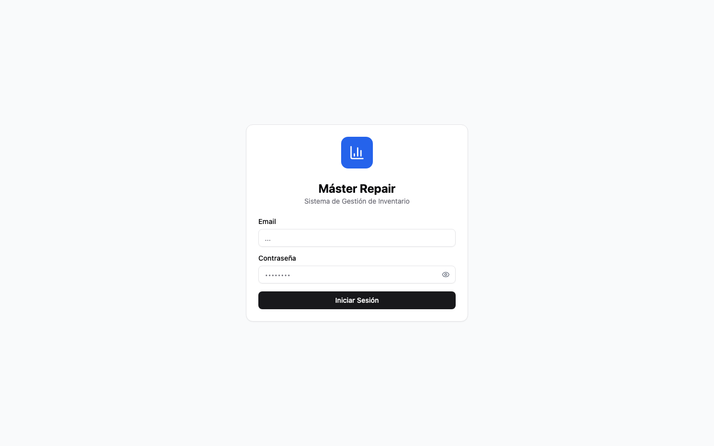

---

## 3. Estructura general de la aplicación

Después de ingresar, verá:
- **Menú lateral** (en computadora) con: Dashboard, Productos, Categorías, Proveedores, Clientes y Órdenes.
- **Menú inferior** (en celular) con los accesos más usados y un botón **Más** para el resto de módulos.
- **Menú de usuario** (arriba a la derecha) con su nombre y rol, para ir a Perfil o cerrar sesión.

### En celular
En pantallas de celular, la parte inferior muestra accesos directos a Inicio, Productos, Órdenes y Proveedores. El botón **Más** abre un panel con Categorías, Clientes, Perfil y Cerrar Sesión.

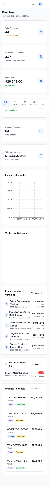

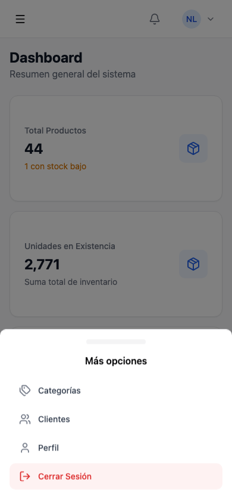

### Menú de usuario y cerrar sesión
1. Pulse su nombre y avatar (arriba a la derecha).
2. Desde ahí puede ir a **Perfil** o seleccionar **Cerrar Sesión**.

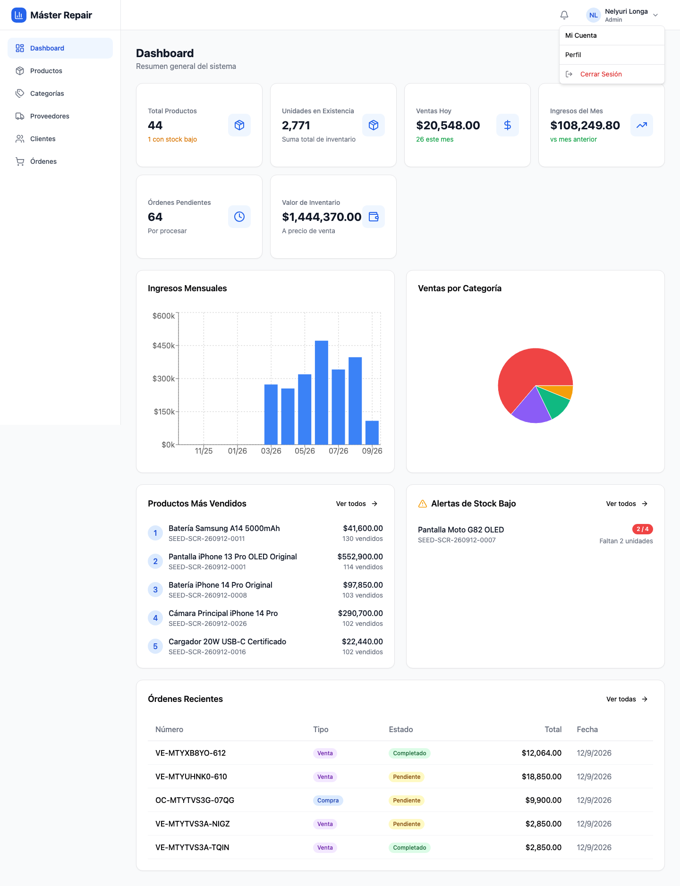

> **Nota:** el ícono de campana (notificaciones) que aparece junto al menú de usuario todavía no tiene funcionalidad; es una mejora pendiente del sistema. Lo mismo ocurre con la opción "Configuración", que aún no está disponible.

---

## 4. Dashboard (pantalla principal)
El Dashboard es un resumen general del negocio. Lo que ve aquí depende de su rol.

### Vista de Administrador o Gerente
Muestra información completa del negocio:
- Total de productos y unidades en existencia
- Ventas del día e ingresos del mes
- Órdenes pendientes y valor total del inventario
- Gráfico de ingresos mensuales
- Gráfico de ventas por categoría
- Ranking de productos más vendidos
- Alertas de stock bajo
- Órdenes recientes

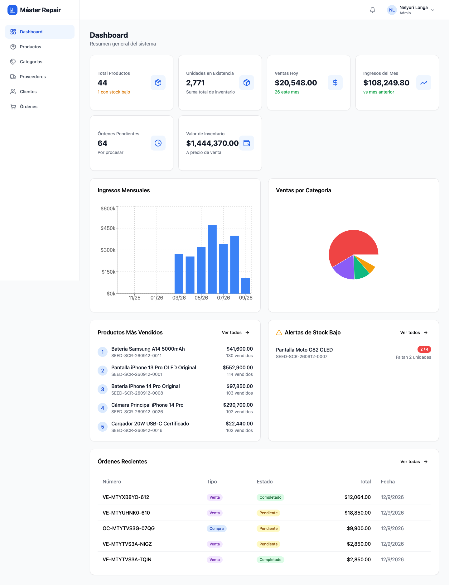

### Vista de Cajero
Un usuario con rol Cajero ve una versión reducida, sin cifras financieras del negocio (no ve ventas del día, ingresos del mes, valor de inventario, gráficos ni el ranking de productos más vendidos). Sí ve el total de productos, las unidades en existencia, las órdenes pendientes, las alertas de stock bajo y las órdenes recientes.

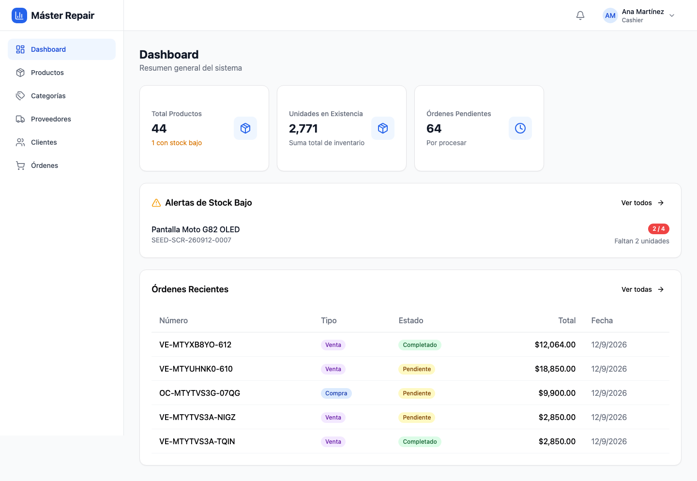

### Acción útil
Al hacer clic en varias tarjetas o secciones, el sistema lo lleva al módulo relacionado (por ejemplo, Productos u Órdenes).

---

## 5. Módulo de Productos
En este módulo puede buscar, crear, editar, eliminar y exportar productos.

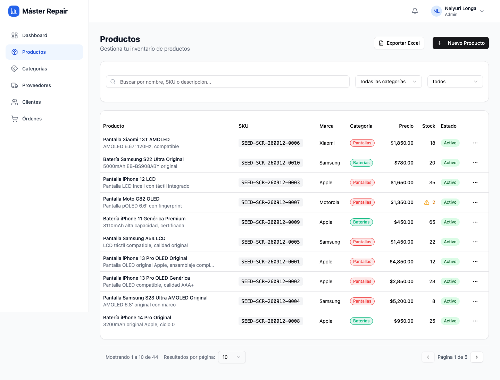

### 5.1. Acciones principales
- **Nuevo Producto**: crea un producto nuevo.
- **Exportar Excel**: descarga una hoja con los productos filtrados.
- **Buscar**: por nombre, SKU o descripción.
- **Filtrar por categoría**.
- **Filtrar por estado**: Activo / Inactivo.
- **Editar** un producto.
- **Eliminar** un producto (pide confirmación).

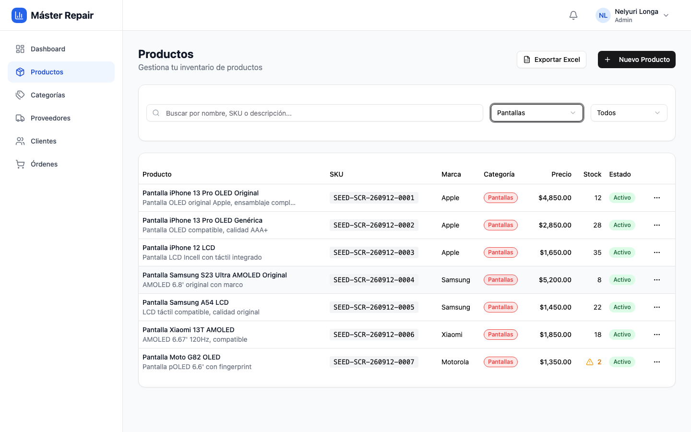

> **Nota según su rol:** solo Administrador y Gerente pueden crear, editar, eliminar y exportar productos. Un usuario con rol Cajero solo puede consultar el listado, sin esos botones.

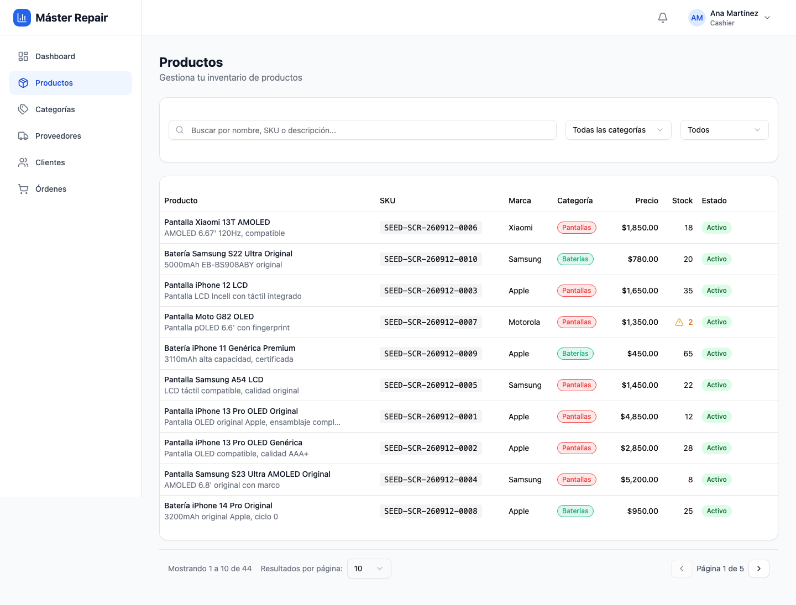

### 5.2. Crear un producto
1. Entre a **Productos**.
2. Pulse **Nuevo Producto**.
3. Complete los datos:
   - Información básica: nombre, descripción, marca, categoría y proveedor
   - Precios: precio unitario, precio mayorista (opcional) y escalas de precio por cantidad (opcional)
   - Inventario: stock actual, stock mínimo y ubicación (opcional)
   - Estado activo/inactivo
4. Pulse **Crear Producto**.

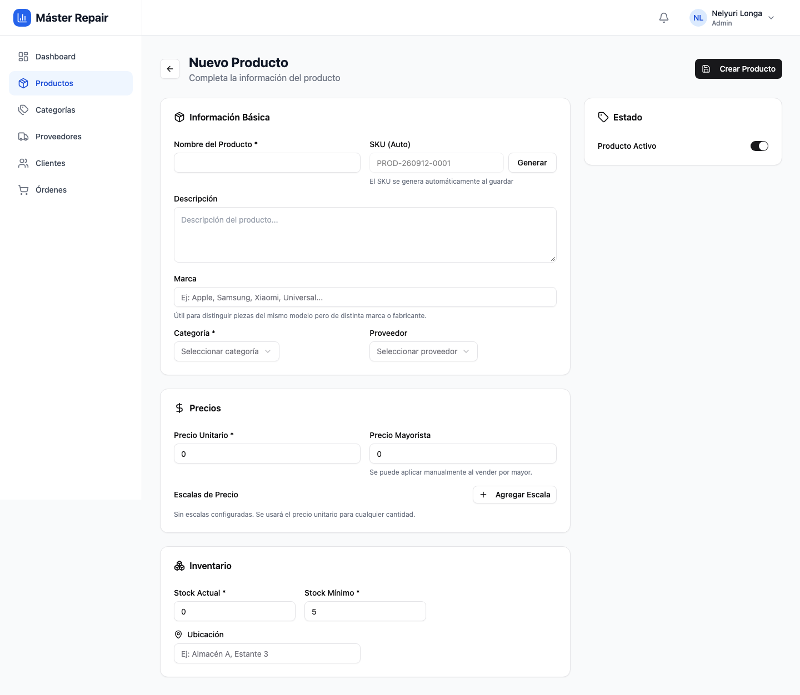

> **El SKU ya no se escribe a mano.** El sistema genera automáticamente un código único para cada producto nuevo (por ejemplo `PROD-260912-0001`); ese campo queda bloqueado al crear. Solo se puede ajustar manualmente cuando se está editando un producto ya existente.

**Escalas de precio por cantidad:** puede definir precios especiales según la cantidad que se venda (por ejemplo, un precio menor si el cliente compra 5 unidades o más). Pulse **Agregar Escala**, indique la cantidad mínima y el precio para esa cantidad. Puede agregar varias escalas. Estas escalas se aplican automáticamente al momento de vender, según la cantidad que se agregue a la orden.

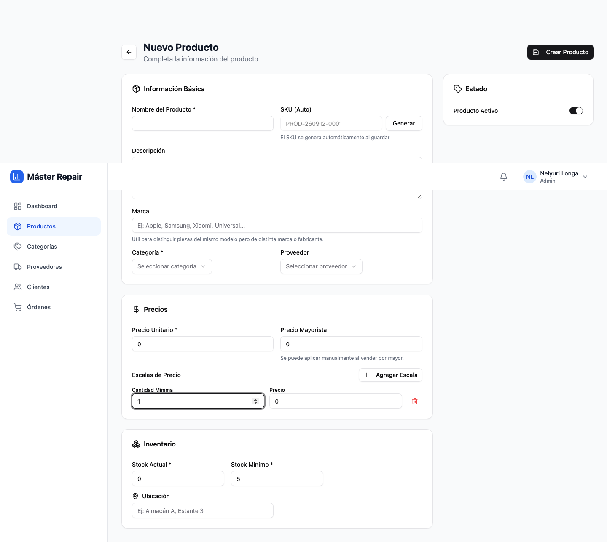

### 5.3. Editar un producto
1. En la lista de productos, abra el menú de acciones (ícono de tres puntos) y pulse **Editar**.
2. Cambie los datos necesarios (aquí sí puede modificar el SKU si lo requiere).
3. Pulse **Guardar Cambios**.

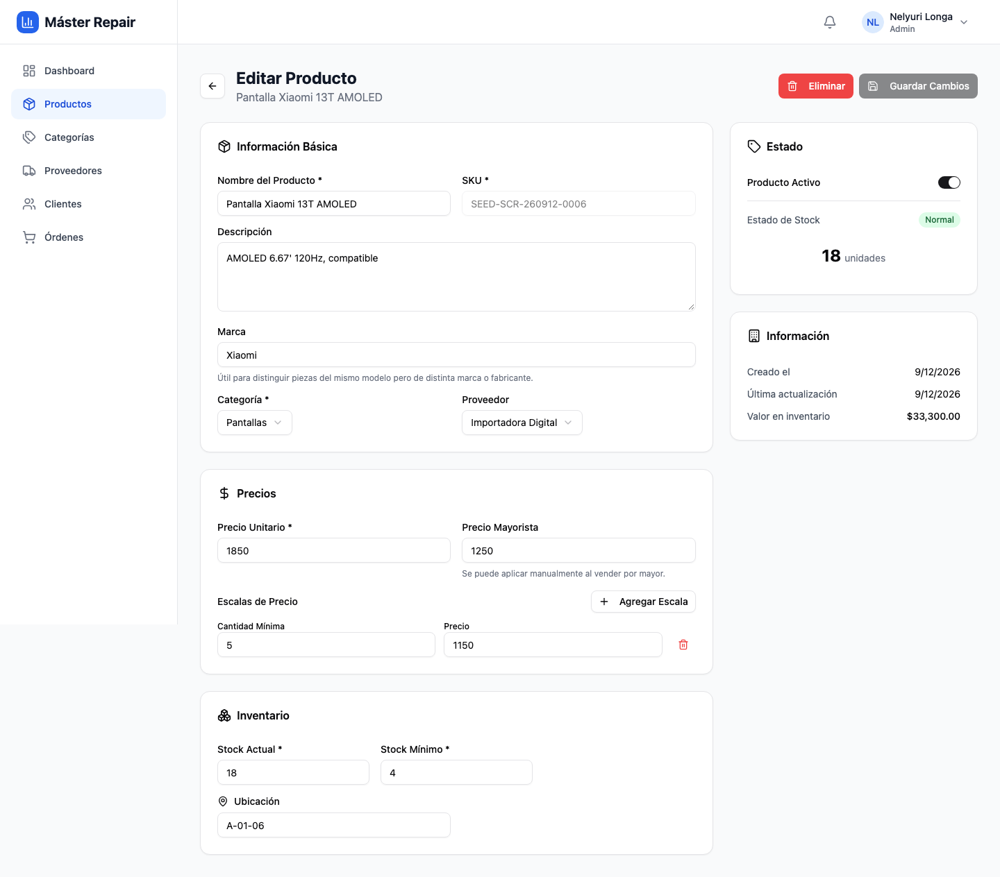

### 5.4. Eliminar un producto
1. En el menú de acciones del producto, pulse **Eliminar**.
2. El navegador le mostrará un mensaje emergente pidiendo confirmar la acción. Acepte para eliminar definitivamente, o cancele para no hacer cambios.

### 5.5. Exportar a Excel
1. Pulse **Exportar Excel**.
2. Elija las columnas que desea incluir.
3. Pulse **Descargar Excel**.

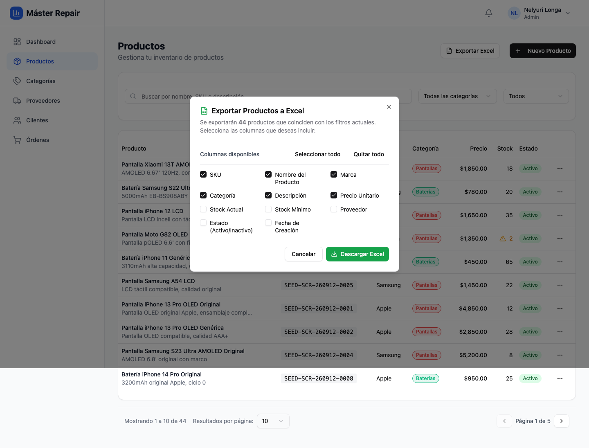

### 5.6. Información que verá en la tabla
- Nombre, SKU y marca
- Categoría
- Precio
- Stock (con alerta visual si está bajo)
- Estado (Activo/Inactivo)

---

## 6. Módulo de Categorías
Aquí administra los tipos de productos.

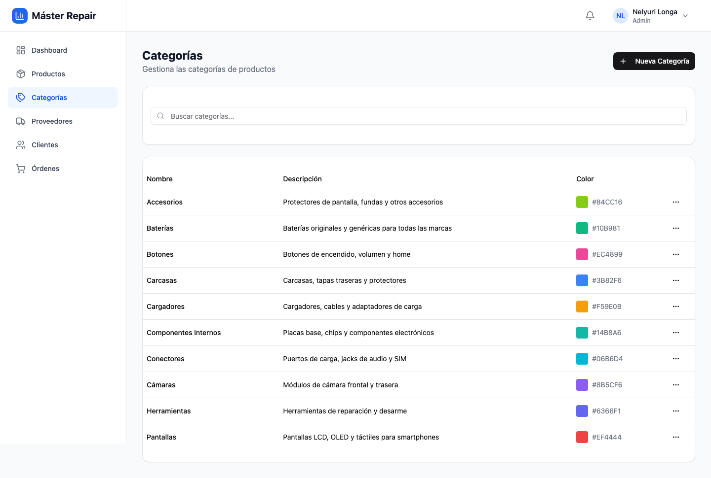

### 6.1. Acciones disponibles
- **Nueva Categoría**
- **Buscar categorías**
- **Editar categoría**
- **Eliminar categoría** (con confirmación)

> **Nota según su rol:** crear, editar y eliminar categorías solo está disponible para Administrador y Gerente. Un usuario Cajero solo puede consultar el listado.

### 6.2. Crear categoría
1. Entre a **Categorías**.
2. Pulse **Nueva Categoría**.
3. Complete:
   - Nombre
   - Descripción (opcional)
   - Color
4. Pulse **Guardar**.

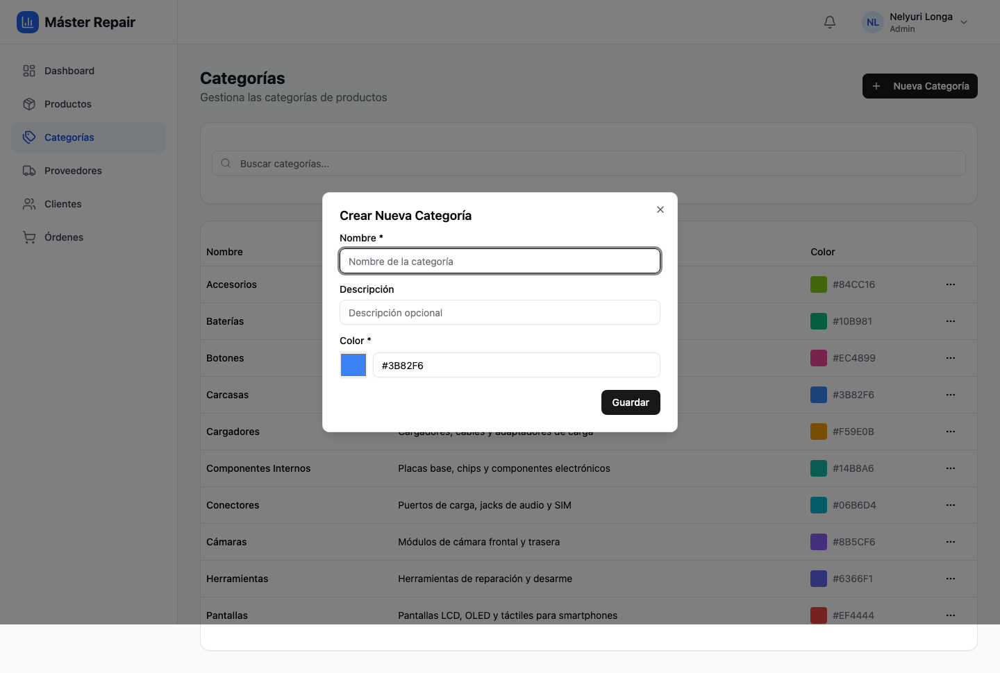

### 6.3. Editar categoría
1. Abra el menú de acciones (botón de tres puntos).
2. Pulse **Editar**.
3. Realice cambios y guarde.

### 6.4. Eliminar categoría
1. En el menú de acciones, pulse **Eliminar**.
2. Confirme en el mensaje emergente del navegador para finalizar.

---

## 7. Módulo de Proveedores
Aquí registra y mantiene la información de sus proveedores.

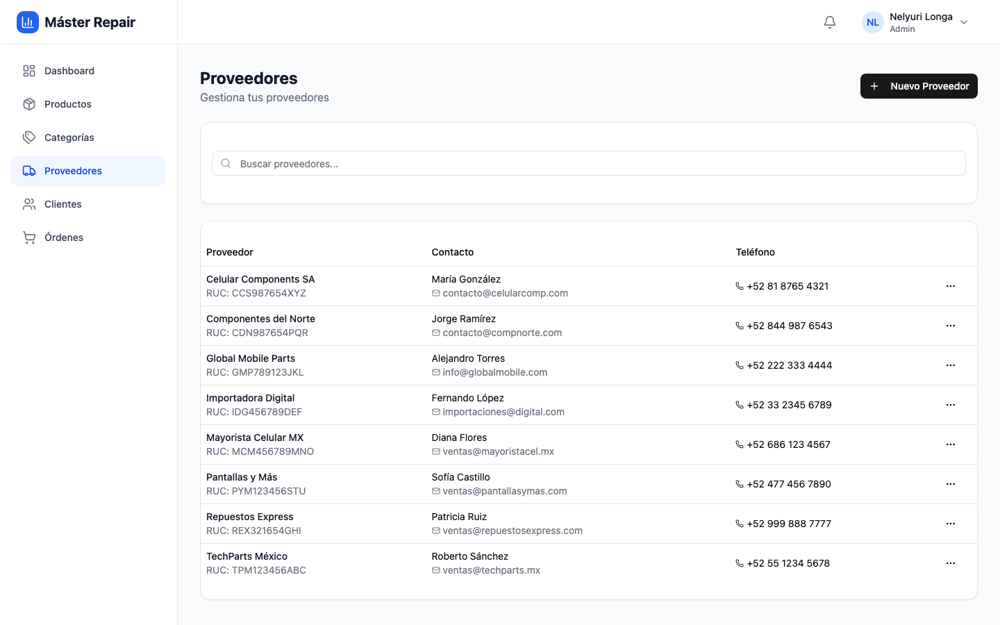

### 7.1. Acciones disponibles
- **Nuevo Proveedor**
- **Buscar proveedores**
- **Editar proveedor**
- **Eliminar proveedor**

> **Nota según su rol:** crear, editar y eliminar proveedores solo está disponible para Administrador y Gerente.

### 7.2. Crear proveedor
1. Entre a **Proveedores**.
2. Pulse **Nuevo Proveedor**.
3. Complete los datos:
   - Nombre
   - Persona de contacto
   - Email
   - Teléfono
   - RUC/NIT
   - Dirección
4. Pulse **Guardar**.

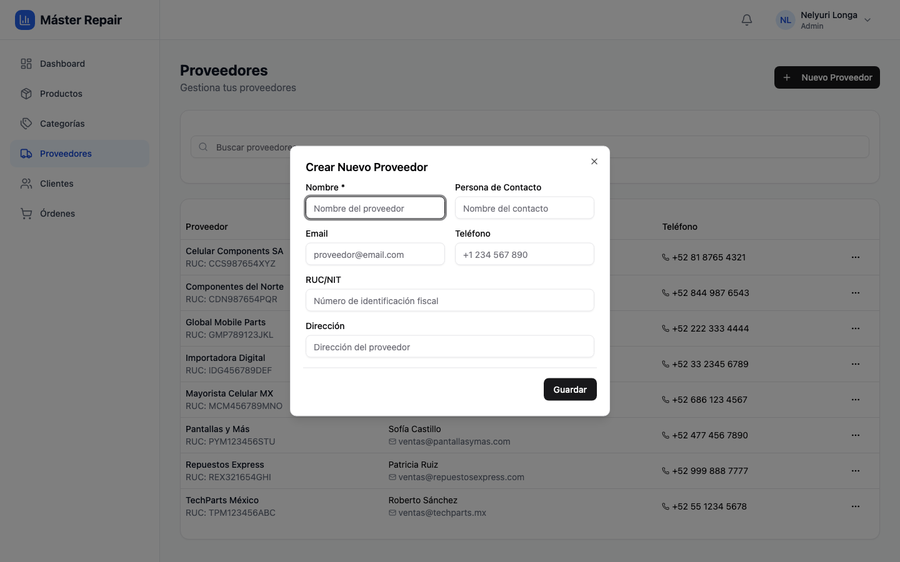

### 7.3. Editar proveedor
1. En la fila del proveedor, abra el menú de acciones.
2. Pulse **Editar**.
3. Actualice la información y guarde.

### 7.4. Eliminar proveedor
1. En el menú de acciones, pulse **Eliminar**.
2. Confirme la eliminación en el mensaje emergente del navegador.

---

## 8. Módulo de Clientes
Este es un módulo nuevo, pensado para llevar el registro de las personas o negocios a los que usted les vende, y consultar su historial de compras.

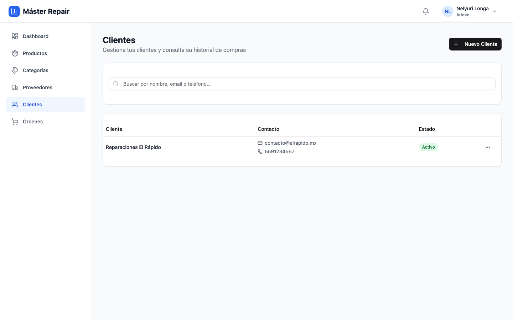

### 8.1. Acciones disponibles
- **Nuevo Cliente**
- **Buscar** por nombre, email o teléfono
- **Ver detalle** de un cliente (historial de compras y estadísticas)
- **Editar** los datos de un cliente
- **Activar/Desactivar** un cliente
- **Eliminar** un cliente

### 8.2. Crear un cliente
1. Entre a **Clientes**.
2. Pulse **Nuevo Cliente**.
3. Complete nombre, email y teléfono (el email y teléfono son opcionales, pero el nombre y el email deben ser únicos en el sistema).
4. Pulse **Guardar**.

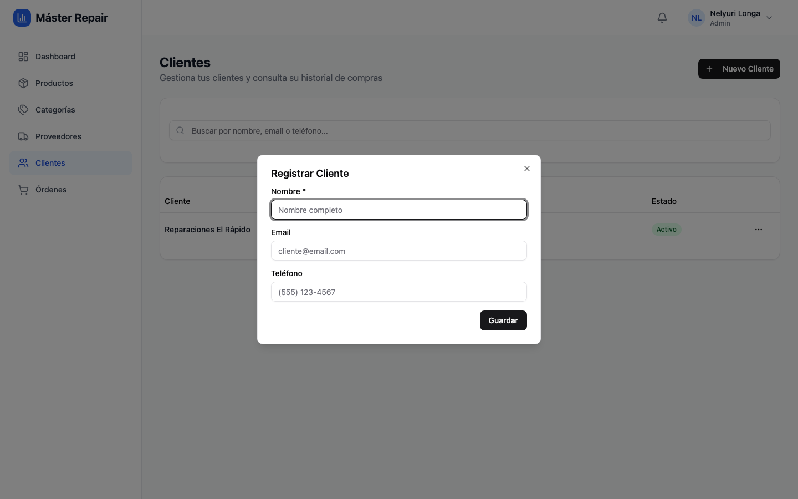

### 8.3. Ver el detalle de un cliente
Al pulsar sobre un cliente en la lista, accede a su ficha con:
- Cantidad de compras completadas y total gastado
- Historial de compras (número de orden, fecha, estado y total)
- Datos de contacto, editables desde esta misma pantalla
- Un interruptor para activar o desactivar al cliente (un cliente inactivo no se puede seleccionar en nuevas ventas)

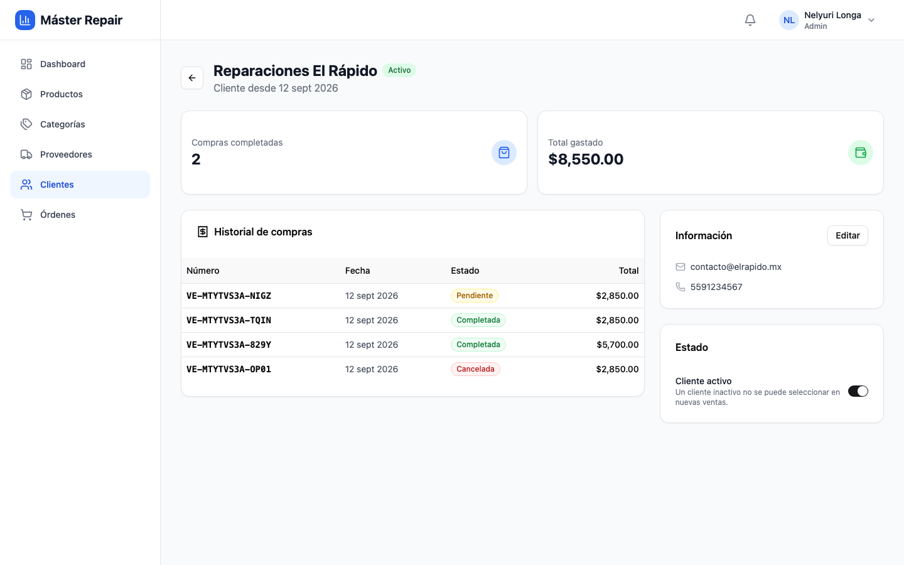

> **Nota según su rol:** cualquier usuario puede crear y editar clientes. Eliminar un cliente y activar/desactivarlo solo está disponible para Administrador y Gerente.

---

## 9. Módulo de Órdenes
Este módulo le permite crear y controlar movimientos de inventario: ventas y compras.

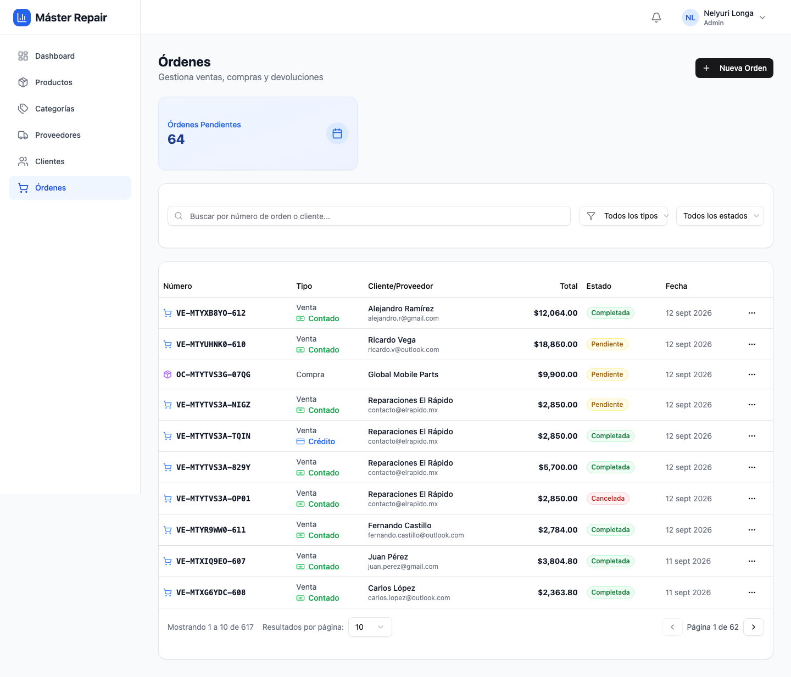

### 9.1. Qué puede hacer
- **Nueva Orden**
- **Buscar órdenes** por número o cliente
- **Filtrar por tipo** (Ventas/Compras)
- **Filtrar por estado** (Pendiente/Completada/Cancelada)
- **Ver detalle** de una orden
- **Completar orden** (si está pendiente)
- **Cancelar orden** (si está pendiente)
- **Editar orden** (solo si está pendiente, y solo para Administrador/Gerente)

### 9.2. Tipos de orden
Al crear una orden nueva solo puede elegir entre **Venta** o **Compra**. El sistema también reconoce un tercer tipo, **Devolución**, pero es un valor histórico: ya no se puede generar una devolución nueva desde el formulario de creación, solo se muestra si existía previamente en el historial.

### 9.3. Estados de una orden
- **Pendiente**: aún se puede editar, completar o cancelar.
- **Completada**: ya finalizada, no editable.
- **Cancelada**: anulada, no editable.

### 9.4. Crear una orden nueva
1. Entre a **Órdenes**.
2. Pulse **Nueva Orden**.
3. Seleccione el **tipo de orden**: Venta o Compra.
4. Complete los datos según el tipo:
   - Para **compras**: seleccione el proveedor.
   - Para **ventas**: busque un cliente ya registrado por nombre, email o teléfono, o pulse **Registrar nuevo cliente** para darlo de alta sin salir de la orden. También indique el **tipo de pago**: Contado o Crédito.
5. Agregue productos:
   - Busque el producto por nombre o SKU.
   - Indique la cantidad.
   - Pulse **Agregar Producto**.
   - Si el producto tiene escalas de precio configuradas, el precio se ajusta automáticamente según la cantidad (se marca como "Escala aplicada").
   - El sistema valida en tiempo real que haya stock suficiente antes de permitir agregar el producto.
6. Revise el subtotal y el total en el resumen de la orden.
7. Pulse **Crear Orden**.

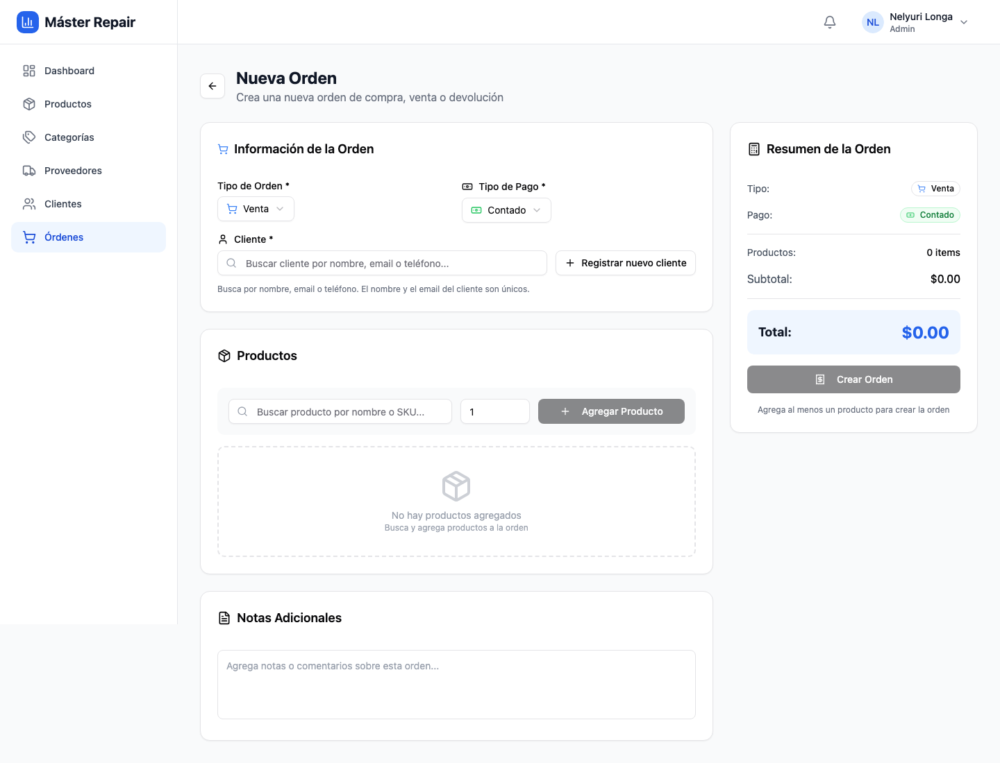

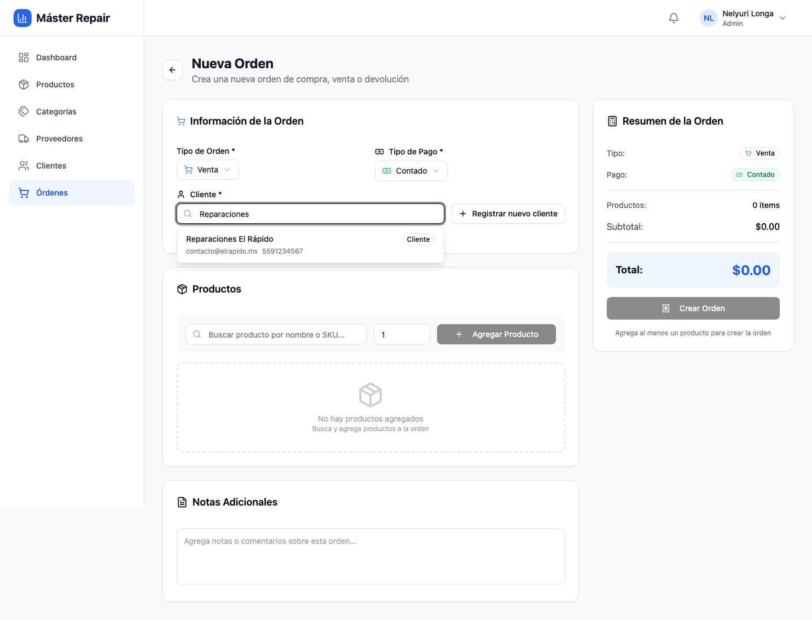

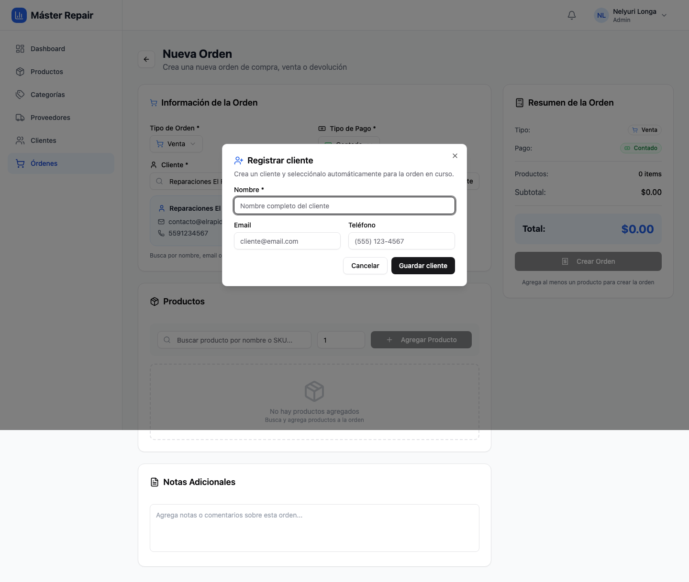

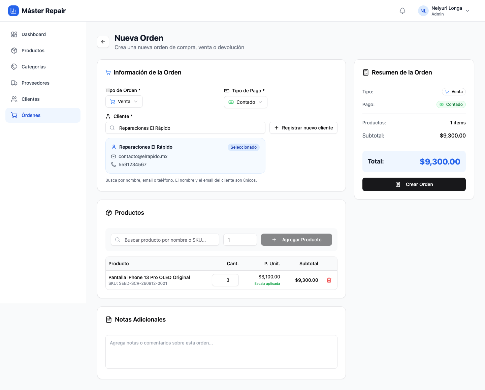

### 9.5. Ver detalle de orden
Dentro del detalle verá:
- Número y estado de la orden
- Tipo de movimiento y, en ventas, el tipo de pago (Contado/Crédito)
- Lista de productos (cantidad, precio unitario, total)
- Resumen de montos (subtotal, impuestos y descuento si aplican, y total)
- Datos del cliente o proveedor
- Notas
- Quién creó la orden y la fecha

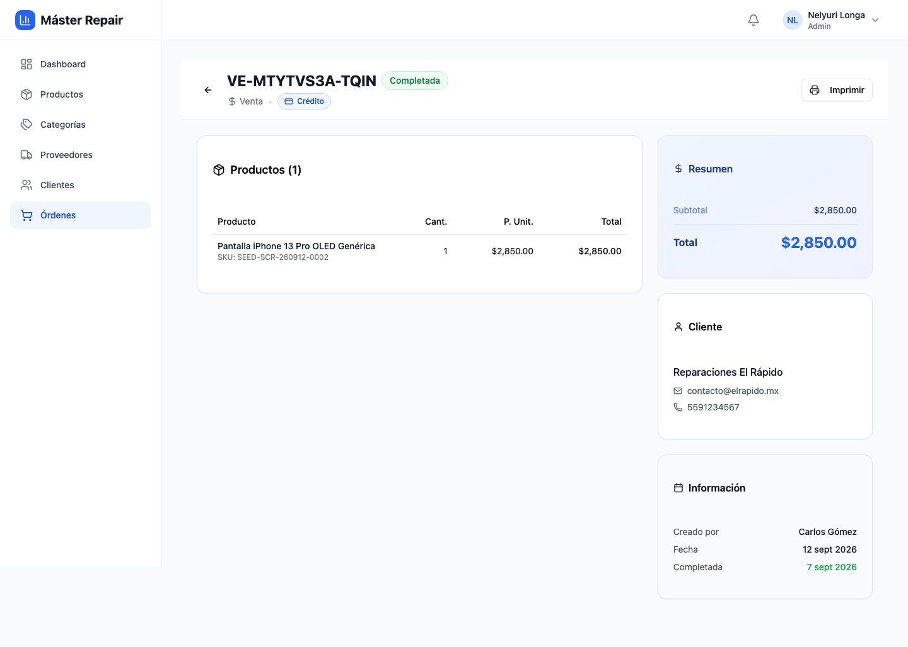

### 9.6. Acciones desde el detalle
- **Imprimir**
- **Editar** (si está pendiente, solo Administrador/Gerente)
- **Completar** (si está pendiente)
- **Cancelar** (si está pendiente)
- **Copiar para WhatsApp** (solo en órdenes de compra pendientes): copia al portapapeles un mensaje ya redactado con los productos y cantidades, listo para pegar y enviar por WhatsApp a su proveedor.

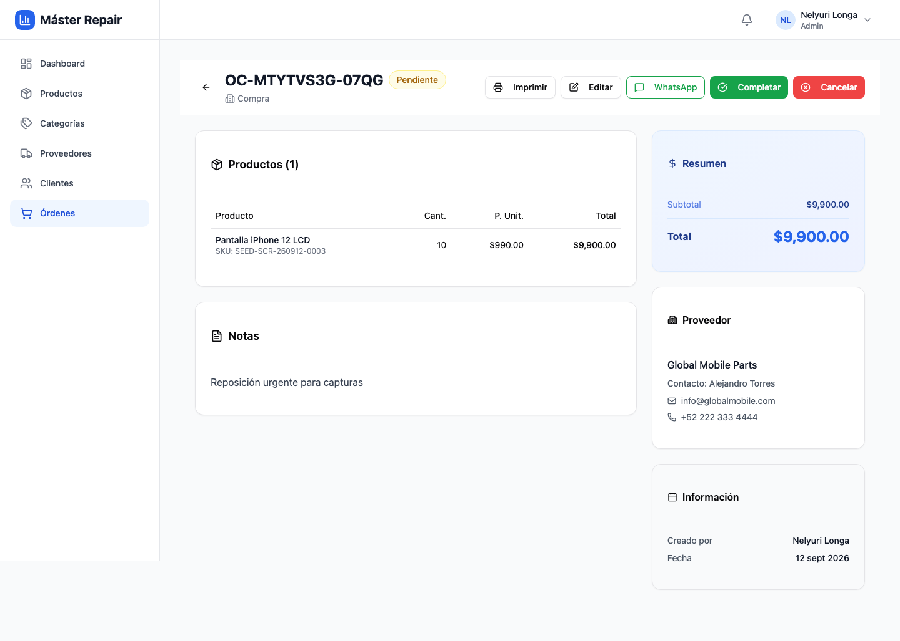

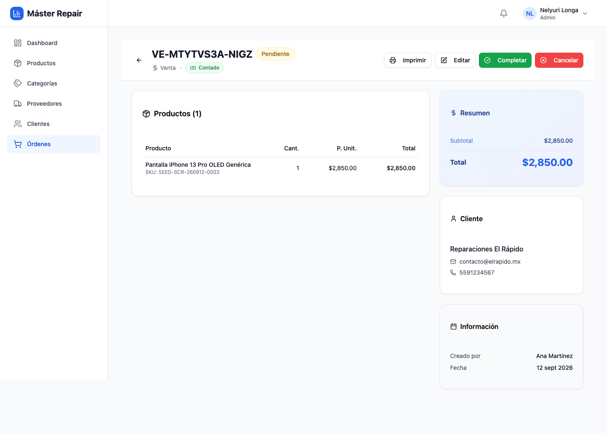

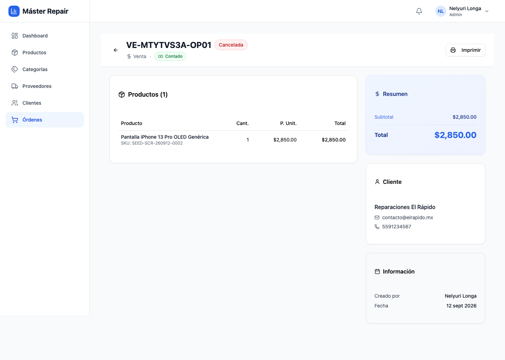

### 9.7. Editar una orden
- Solo se puede si está en estado **Pendiente**, y solo si su usuario tiene rol Administrador o Gerente.
- Si la orden está completada o cancelada, el sistema muestra un aviso y bloquea la edición.
- El tipo de orden (Venta/Compra) no se puede cambiar una vez creada.

> **Nota según su rol:** un usuario con rol Cajero puede crear ventas y consultar órdenes, pero no ve el botón "Editar" en el detalle ni puede acceder a la edición de órdenes.

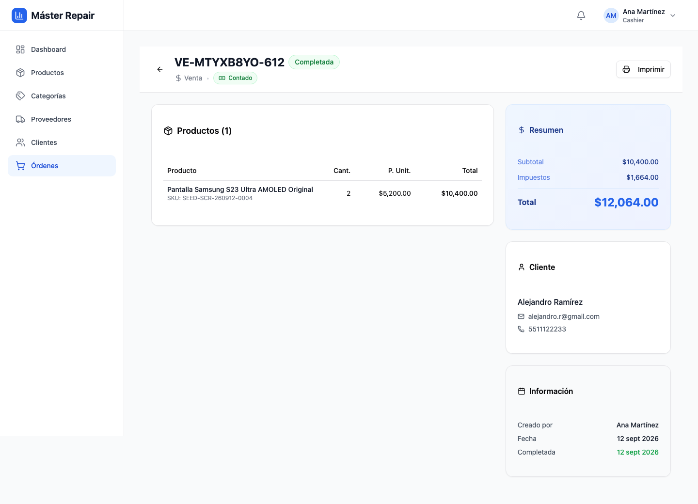

---

## 10. Perfil de usuario
En el módulo **Perfil** puede gestionar su información personal y seguridad.

### 10.1. Información General
Permite actualizar:
- Nombre
- Apellido
- Email

Pasos:
1. Abra **Perfil**.
2. En la pestaña **Información General**, edite sus datos.
3. Pulse **Guardar Cambios**.

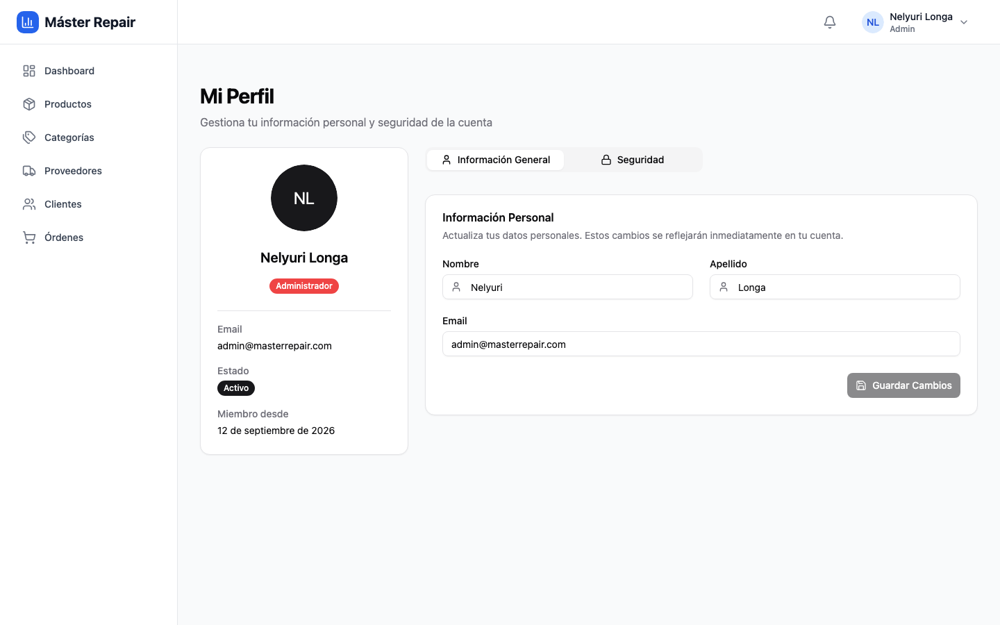

### 10.2. Seguridad (cambio de contraseña)
Pasos:
1. Abra la pestaña **Seguridad**.
2. Escriba:
   - Contraseña actual
   - Nueva contraseña
   - Confirmación de nueva contraseña
3. Pulse **Cambiar Contraseña**.

También puede usar el ícono de ojo para mostrar/ocultar cada contraseña.

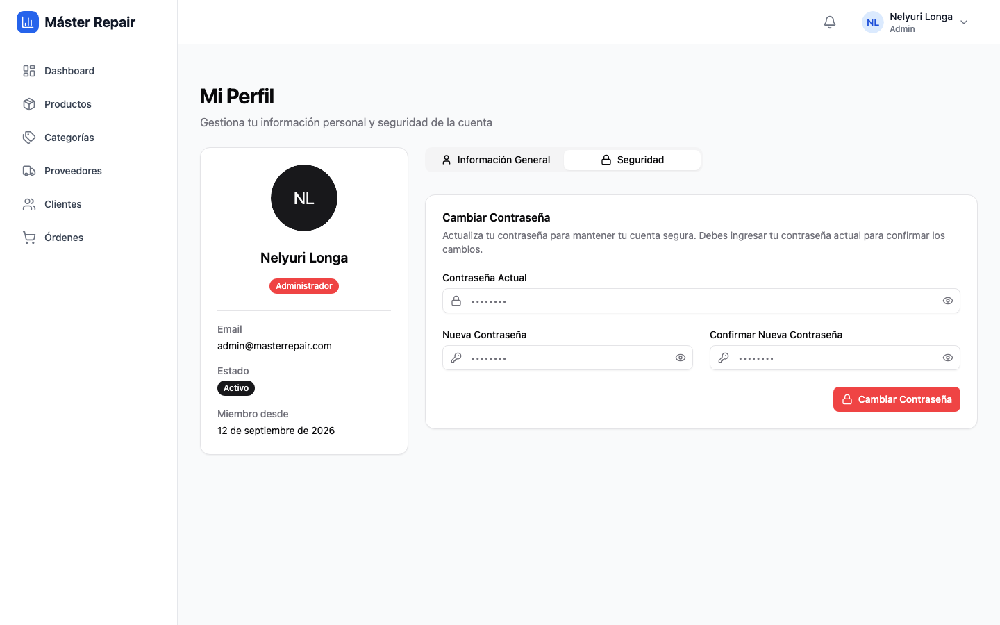

> **Requisitos de la nueva contraseña:** debe tener al menos 6 caracteres, e incluir al menos una letra mayúscula, una letra minúscula y un número.
>
> **Importante:** al cambiar su contraseña, el sistema cierra automáticamente cualquier otra sesión abierta en otros dispositivos, por seguridad. Deberá volver a iniciar sesión en esos dispositivos con la nueva contraseña.

### 10.3. Información visible en el perfil
- Nombre completo
- Rol de usuario (Administrador, Gerente o Cajero)
- Email
- Estado de la cuenta
- Fecha de creación de la cuenta

---

## 11. Búsqueda, filtros y paginación (aplica a varios módulos)
En Productos, Categorías, Proveedores, Clientes y Órdenes encontrará funciones comunes:

- **Buscador**: para encontrar registros más rápido.
- **Filtros**: para acotar resultados.
- **Paginación**:
  - Cambiar de página
  - Elegir cuántos resultados ver por página
  - Ver cuántos registros se están mostrando

---

## 12. Consejos rápidos para uso diario
- Revise el **Dashboard** al iniciar su jornada.
- Mantenga productos y stock actualizados para evitar errores en ventas.
- Registre a sus clientes frecuentes para llevar su historial de compras.
- Use estados de órdenes para controlar el avance de cada operación.
- Complete o cancele órdenes pendientes para mantener el sistema ordenado.
- Cambie su contraseña periódicamente para mayor seguridad.

---

## 13. Flujo recomendado de trabajo (resumen)
1. Iniciar sesión.
2. Revisar Dashboard (estado general).
3. Validar categorías y proveedores (si hay cambios).
4. Crear/actualizar productos.
5. Registrar o consultar clientes según sea necesario.
6. Registrar órdenes (ventas o compras).
7. Gestionar órdenes pendientes hasta completarlas o cancelarlas.
8. Revisar perfil y mantener datos actualizados.
9. Cerrar sesión al terminar.

---

## 14. Soporte
Si alguna acción no funciona como espera:
- Verifique que todos los campos obligatorios estén completos.
- Revise mensajes en pantalla (normalmente indican qué corregir).
- Si el problema persiste, contacte al responsable de soporte de su sistema.

---

## Apéndice A: Roles y permisos del sistema

El sistema cuenta con tres roles de usuario, cada uno con un nivel de acceso distinto:

| Módulo / Acción | Administrador | Gerente | Cajero |
|---|:---:|:---:|:---:|
| Ver Dashboard completo (cifras financieras y gráficos) | Sí | Sí | No (vista reducida) |
| Crear, editar y eliminar Productos | Sí | Sí | No (solo consulta) |
| Exportar Productos a Excel | Sí | Sí | No |
| Crear, editar y eliminar Categorías | Sí | Sí | No (solo consulta) |
| Crear, editar y eliminar Proveedores | Sí | Sí | No (solo consulta) |
| Crear y editar Clientes | Sí | Sí | Sí |
| Eliminar y activar/desactivar Clientes | Sí | Sí | No |
| Crear Órdenes (ventas) | Sí | Sí | Sí |
| Editar Órdenes | Sí | Sí | No |
| Completar/Cancelar Órdenes pendientes | Sí | Sí | Sí |
| Registrar nuevos usuarios del sistema | Sí | No | No |

Notas adicionales:
- Un usuario que intenta acceder por dirección web directa a una pantalla que no le corresponde (por ejemplo, la edición de un producto siendo Cajero) es redirigido automáticamente al Dashboard.
- La opción **Configuración** del menú y el ícono de **notificaciones** se muestran en la interfaz, pero todavía no tienen funcionalidad activa; quedan reservados para una futura actualización.

---

**Fin del Manual de Usuario**
